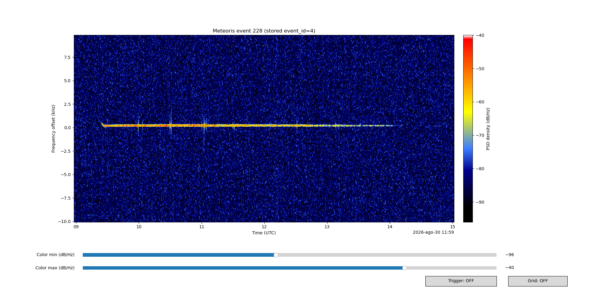
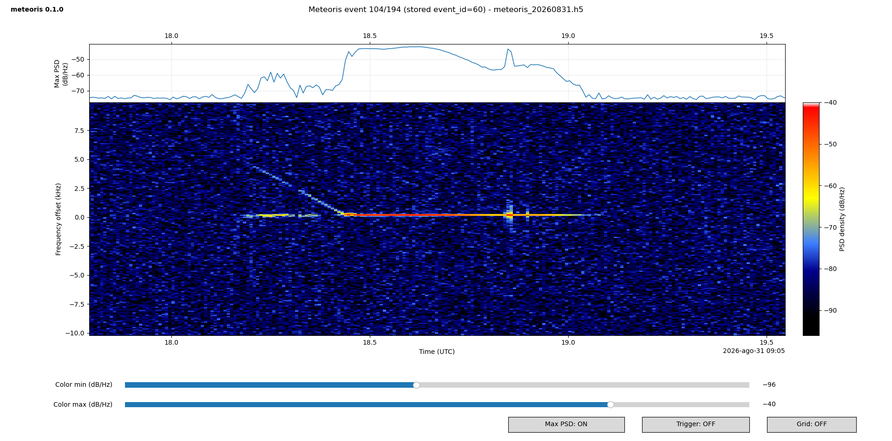

# Meteoris

Meteoris is a program suite for real-time capture, recording, and analysis of
radio signals produced by meteor scatter. It works with any SDR receiver
supported by [SoapySDR drivers](https://github.com/pothosware/SoapySDR/wiki).

It consists of a capture/recording program (`meteoris`) that continuously
listens for incoming signals and saves them to a file when a meteor signal is
detected. The other main component is a plotting program (`meteoris_plot`) that
reads recorded meteor-signal events from a file and displays them one at a time
as horizontal waterfall diagrams. A SoapySDR simulator driver is also
available. It synthesizes typical meteor-scatter radio signals that can be
recorded by Meteoris and is useful for adjusting critical receiver and detector
parameters.

Meteoris has currently been tested on Linux with the [HackRF One
SDR](https://hackrf.readthedocs.io/en/latest/hackrf_one.html).
Meteoris is currently at version 0.2.0 and should therefore be considered alpha
software.

### Author's Note

This project is completely AI-generated; the code has not been manually
reviewed line by line. Only this README was originally handwritten. The
authour provided the ideas, requirements, and some of the solutions.
Without AI, this project probably would not exist.


# Main Features

  * Supports SDR receivers available through SoapySDR.
  * Fully configurable through a file or command-line options.
  * Continuous **10 Msps** input.
  * Final selectable **100 kHz observation band**.
  * Pluggable meteor signal detectors, including peak/track and
    Echoes-style automatic threshold detection.
  * Efficient HDF5 storage format for meteor-event data.
  * Event-list display with details for each event.
  * Event waterfall display with time/frequency axes and signal
    level represented by color.
  * SDR simulator that generates synthetic meteor-scatter radio signals
    for testing and calibration.


# [Download, Build and Install](doc/INSTALL.md)


# Set Meteoris Configuration

Meteoris uses the simple [TOML format](https://toml.io/en/) for its
configuration files. A TOML file is divided into sections identified by names
in square brackets (for example, `[this_is_a_section_id]`). Each section
contains parameters, normally one per line, written as a parameter name
followed by its value (for example, `parameter1 = 100`).

## Essential parameters

### The SDR Section Parameters

Set the proper SoapySDR driver for the SDR that is connected to the computer.
The driver identifier strings are in the Soapy documentation.

Set the appropriate sample rate. Meteoris is designed to operate with input
sample rates up to 10 MHz. Lower sample rates are possible; check compatibility
with your SDR and the configured DSP chain.

Set the center frequency, i.e. the SDR tuning frequency. This parameter depends
on the transmitter used for meteor-scatter reception. Some examples of
transmitters used for this purpose are:

- GRAVES 143.050 MHz (Dijon, France)
- BRAMS   49.970 MHz (Dourbes, Belgium)
- GB3MBA  50.408 MHz (Sutton-in-Ashfield, UK)

Set the SDR gain. In general, a relatively high value can be used initially
because meteor-scatter signals are quite weak. However, excessive gain can
overload the receiver. If a strong recorded signal shows symmetric sidebands at
approximately ±1.22 kHz from the carrier, reduce the gain until the sidebands
disappear. 

The following is an example configuration for a HackRF One SDR at a 10 MHz
sample rate using the GRAVES transmitter:

```
[sdr]
driver = "hackrf"
sample_rate = 10000000
center_frequency = 143050000
gain = 80
```


### Center Frequency May Be Tricky

Many SDRs, especially low-cost devices, do not completely suppress the DC
component (frequency = 0 Hz) caused by small leakage from the receiver's local
oscillator. As a result, a strong spur may appear at the center of the received
band and hide signals close to zero frequency. This problem can be avoided by
using a tuning offset so that the unwanted DC component is moved away from the
frequency region of interest.

A second tuning issue affects SDRs that are not synchronized to an external
reference clock, such as a GPS-disciplined reference. Low-cost crystal or
ceramic oscillators can have frequency errors that drift with temperature,
sometimes by 1 kHz or more at the received RF frequency.

These problems can be handled with the **`shift_hz`** parameter in the
**`[dsp]`** section. This parameter digitally translates the received complex
baseband and can therefore compensate for the intentional tuning offset and
receiver frequency error.

For example, to receive the GRAVES transmitter at 143.050 MHz, move the DC
spur approximately 1 MHz up away from the signal and compensate for a receiver
frequency error of about -1.35 kHz, the center frequency is raised by 1 MHz and the shift frequency is set to the sum of the raised quantity (+1000000) and
the -1.35 kHz compensation (+998650 Hz). See the configuration below.

``` 
[sdr]
...
center_frequency = 144050000
...

[dsp]
...
shift_hz = +998650
...
```

### The DSP Section Parameters

This section defines the parameters of the Meteoris digital signal-processing
chain. Apart from the **`shift_hz`** parameter discussed above, the supplied
configuration provides suitable defaults for the other DSP parameters.

### The Detector Section Parameters

Meteoris provides compile-time detector plugins selected with
`detector.plugin`.

The default `peak_tracker` detector detects **spectral peaks and their motion
through time**.

Each PSD is first averaged in linear power across a small centered frequency
window and then across a short causal time window. Local maxima are extracted
when they rise by `peak_threshold_db` above the median of the blurred PSD.
Nearby maxima are consolidated into one peak.

The resulting peaks are associated from PSD to PSD into tentative tracks.
Tracks can become:

- **stationary**, for slowly moving peaks in a configurable region near zero
  frequency;
- **chirp**, for rapidly moving peaks across the observation band.

A track becomes active only after satisfying both a minimum age and a minimum
fraction of successful peak observations. Short missing intervals are
tolerated through `lost_s`.

Recording starts when the number of active tracks changes from zero to one or
more, and trigger OFF occurs when the last active track is lost. Existing
pre/post context, HDF5 recording, event merging, maximum event duration, daily
rotation and graceful shutdown behavior remain common to both signal types.

A useful starting configuration is:

```toml
[detector]
plugin = "peak_tracker"
frequency_mean_bins = 5
time_mean_psds = 3
peak_threshold_db = 5.0
min_peak_separation_hz = 300
max_peaks_per_psd = 20

[detector.stationary]
min_hz = -5000
max_hz = 5000
max_df_hz = 250
activation_time_s = 0.5
activation_fraction = 0.50
lost_s = 0.30

[detector.chirp]
min_hz = -50000
max_hz = 50000
max_df_hz = 1500
activation_time_s = 0.05
activation_fraction = 0.70
lost_s = 0.08
min_drift_hz_s = 3000
max_drift_hz_s = 150000
```

The `echoes_automatic` detector is also available. It adapts the automatic
capture logic used by Echoes to Meteoris's headless PSD recorder. Each PSD is
scanned inside a configurable frequency interval to measure:

- **S**: maximum PSD density in dB/Hz;
- **N**: mean PSD density in dB/Hz;
- **S-N**: peak excess above the mean noise level.

It can trigger with absolute thresholds on S, differential thresholds on S-N,
or automatic thresholds learned from the idle S-N baseline. It also supports a
delayed trigger and a join interval for merging short interruptions into one
event. Select it with:

```toml
[detector]
plugin = "echoes_automatic"
pre_context_s = 0.5
post_context_s = 1.0

[detector.echoes]
threshold_mode = "automatic"
detection_center_hz = 0
detection_width_hz = 0
automatic_lower_offset_db = 4
automatic_upper_delta_db = 3
automatic_warmup_s = 5
automatic_baseline_time_constant_s = 30
automatic_stddev_window_s = 1
automatic_end_stddev_factor = 2
delay_before_trigger_s = 0
join_events_closer_than_s = 1
```

The detailed detector algorithms and all tuning parameters are documented in
[`doc/DETECTOR.md`](doc/DETECTOR.md),
[`doc/ECHOES_AUTOMATIC_DETECTOR.md`](doc/ECHOES_AUTOMATIC_DETECTOR.md), and
[`doc/CONFIG_FILE_REFERENCE.md`](doc/CONFIG_FILE_REFERENCE.md).

### The Output Section Parameters

By default, Meteoris saves data in the **`data`** subdirectory. Files use the
**`meteoris`** prefix followed by the daily date and the **`.h5`** suffix. If
these defaults are suitable, no changes are required.

### Parameters in All Other Sections

For a detailed description of every configuration section and parameter, see
the [Configuration File Reference](./doc/CONFIG_FILE_REFERENCE.md).


# Run the Recorder

To run the Meteoris recorder, choose a working directory, copy the example
configuration file (`config/meteoris.toml`) there, adjust it as described
above, and then launch the recorder. If Meteoris is installed system-wide,
simply run:

```bash
meteoris
```

Meteoris is intended for long-running operation. It can run for hours or
days while waiting for events. For unattended operation, Meteoris can be
run as a daemon detached from the terminal:

```bash
meteoris --daemon
```

If the **`[output]`** section is left unchanged, recorded data is written to the
**`data`** subdirectory. Files are rotated daily and named
**`meteoris_YYYYMMDD.h5`**, where `YYYY` is the year, `MM` the month, and `DD`
the day.

Recording can also be continuous, in which case detector triggers are ignored.
This mode is useful for testing and debugging. See
[Recording Modes](#recording-modes) below.

If meteoris fails to open an existing output file after an ungracefull termination, like program kill/crash or system shutdown/crash, there exists a
set of specific tools for output file recovering. See all instuctions in
[Recover HDF5 Output Files](./doc/RECOVER_HDF5.md). 


# Display Recorded Data

The Meteoris display program is normally run from the same working directory as
the recorder. Copy the example plotting configuration
(`config/meteoris_plot.toml`) there and run:

```
meteoris_plot data/meteoris_YYYYMMDD.h5
```

where `YYYYMMDD` is the year, month, and day of the file to display.
The Meteoris viewer accepts the following keys for interactive navigation
through recorded events:

- `Space`/`Enter`: next event
- `Shift+Space`/`Shift+Enter`: previous event
- digits then `Space`/`Enter`: jump to that event
- `Backspace/Delete`: edit jump number
- `Esc`: clear jump number
- `z`/`x`/`c`/`v`: skip by -20/-10/+10/+20 events
- `r`: refresh a live SWMR file
- `q`: quit
- close the window: quit

The viewer also provides interactive PSD color-limit sliders and buttons for
showing/hiding the grid and trigger markers.

Meteoris uses HDF5 Single-Writer/Multiple-Reader (SWMR) mode by default so the
active daily recording can be inspected without stopping acquisition or making
a copy. While browsing an active SWMR file:

- `R` refreshes all growing datasets and the event list.

Example of a typical meteor-scatter event captured by Meteoris. It is an echo
of the GRAVES transmitter (143.050 MHz, Dijon, France) from the overdense
ionized trail of a meteor.



Example of meteor scatter with a complex structure. Spectrogram zoomed.




# Simulator

The Meteoris simulator is a SoapySDR-compatible RX driver for detector and
recorder tests. It generates two independent finite signal classes in
each configurable period:

1. a near-zero stationary echo with linear rise, hold and gradual fade;
2. one spectrally clean descending linear chirp at a separate time.

Noise, amplitudes, timing, stationary offset, and chirp endpoints are configurable
in `[simulator]` inside `config/meteoris_sim.toml`.

Typical defaults are:

```toml
[simulator]
period_s = 8.0
noise_amplitude = 5.0

stationary_enabled = true
stationary_start_s = 0.8
stationary_rise_s = 0.35
stationary_hold_s = 1.0
stationary_fall_s = 0.65
stationary_offset_hz = 0
stationary_amplitude = 3.0

chirp_enabled = true
chirp_start_s = 4.0
chirp_duration_s = 1.2
chirp_start_offset_hz = 38000
chirp_end_offset_hz = 12000
chirp_amplitude = 6.0
```

With the normal `shift_hz = -1000000`, the stationary offset and chirp offsets
appear directly on the final Meteoris PSD frequency axis. Stochastic CS8
rounding is retained to suppress coherent quantization/intermodulation replicas.

The simulator is built as a SoapySDR plugin. During development, run it with:

```bash
./run_sim.sh
```

This forces SoapySDR to use the freshly built plugin from this repository, so
an older installed `meteoris_sim` module cannot silently mask simulator source
changes. Normal `install.sh --local` / `--system` now installs the simulator
plugin too; use `--no-sim` to exclude it.

Select it with:

```toml
[sdr]
driver = "meteoris_sim"
```

At startup the plugin logs `Meteoris simulator finite-events-2` together with
the effective stationary/chirp timing and amplitudes. If that line is absent,
the process is not using this simulator build.

The simulated meteor-scatter sequence contains one stationary-frequency event
at `f = 0` and one chirp event with a rapidly decreasing Doppler frequency,
representing a meteor undergoing strong deceleration.

# References and Internals

[Configuration File Reference](./doc/CONFIG_FILE_REFERENCE.md)

[Detailed Features](./doc/DETAILED_FEATURES.md)

[Detection Algorithm](./doc/DETECTOR.md)
Note: the detector algorithm is still under development and may require
further tuning to reduce false triggers caused by noise.

[Echoes-style Automatic Detector](./doc/ECHOES_AUTOMATIC_DETECTOR.md)

[DSP Pipeline](./doc/DSP_PIPELINE.md)

[HDF5 Recording Format](./doc/RECORDING_FORMAT.md)

[Recover HDF5 Output Files](./doc/RECOVER_HDF5.md)

[BUG20260902: one-PSD spectrogram dropout after trigger ON](./doc/BUG20260902.md)

### Notes

Meteoris currently requires native `CS8` input from the selected SoapySDR
device/driver. The main HackRF acquisition path uses direct buffers when
available.

The Release build enables `-ffast-math` and `-fno-math-errno` for the DSP
executable. `-march=native` is enabled by default and should be disabled for
cross-machine binary distribution.

When available, the optional FFTW backend is recommended for FFT processing.
In local Meteoris benchmarks it gives about a 3x speedup compared with the
embedded radix-2 FFT.

### Tentative-track diagnostics

When no track is active but tentative candidates exist, the `DET` diagnostic
line now includes one representative `tentative{...}` record with class,
frequency, velocity, excess, age, occupancy, hit count and missed time. This
is useful for tuning activation parameters against real stationary echoes and
chirps.

Close-peak consolidation is treated as normal detector behavior. A rate-limited
warning is emitted only when `max_peaks_per_psd` is actually exceeded and peaks
must be dropped.


### Finite stationary and chirp simulator events

The `meteoris_sim` source generates a finite near-zero rise/hold/fade echo and
a separate clean linear chirp instead of a permanent carrier. Both event
amplitudes and timing are independently configurable. CS8 conversion continues
to use stochastic rounding and generous headroom to prevent coherent 2x/3x
intermodulation chirps.


### Daily text-log rotation

Text logging is rotated by UTC logical day by default:

```toml
[logging]
file = "meteoris.log"
daily_rotation = true
daily_rotate_time = "00:00"
```

With rotation enabled, `meteoris.log` becomes files such as
`meteoris_20260829.log`. The `HH:MM` boundary follows the same UTC logical-day
convention as `output.daily_rotate_time`. Log rotation is independent of HDF5
events and occurs on the first log message after the configured boundary.


### SDR overflow handling

SoapySDR stream overflows (`SOAPY_SDR_OVERFLOW`) are treated as recoverable
acquisition errors. Meteoris logs an `error` message, increments the overflow
counter, discards the affected read, and immediately continues acquisition.
Other negative SoapySDR stream errors remain fatal.


### Detector plugin architecture

Detector algorithms are now separated from `meteoris.cpp` behind a versioned
synchronous `IDetector` interface. The detector is selected with:

```toml
[detector]
plugin = "peak_tracker"
threads = 1
```

Available detector plugins are `peak_tracker` and `echoes_automatic`. Their
implementations live in `src/detector/peak_tracker_detector.cpp` and
`src/detector/echoes_automatic_detector.cpp`. Structured metrics and detector
objects cross the interface for logging and future HDF5/plot/replay tools. See
[`doc/DETECTOR_PLUGIN_API.md`](doc/DETECTOR_PLUGIN_API.md).


### Recording modes

Meteoris has two application-level PSD recording modes:

```toml
[recording]
mode = "triggered"
segment_seconds = 15.0
segment_count = 0
```

`triggered` uses the configured detector and preserves the normal pre/post
context and event semantics.

`continuous` ignores detector state and writes every PSD. Continuous data is
divided into bounded sequences of `segment_seconds`. Each sequence receives a
new HDF5 `event_id`; `detector_state` remains neutral (`0`). `segment_count=0`
records indefinitely, while a positive count stops cleanly after that many
complete segments.

The convenience CLI:

```text
--record N
```

selects continuous mode and records `N` segments (`N=0` means unlimited).
`--record-segment-seconds S` overrides segment length.

Daily HDF5 rotation occurs only between continuous segments, so a segment that
crosses the configured daily boundary remains whole in the previous file.


### Logging

Meteoris runtime output is handled by `spdlog`. The default log format is:

```text
<unix-seconds.ms> [level] message
```

Example:

```text
1787983200.137 [info] detector=ON peak_tracker ...
1787983201.044 [debug] DET ready=YES event=IDLE bg=-70.53dB/Hz peaks=0 ...
```

Configure logging with:

```toml
[logging]
level = "info"
color = true
```

Foreground levels are colored when supported: info is green, warnings are
yellow, errors are red, debug/trace messages are white, and critical messages
are bold red. Detector periodic diagnostics
are emitted at `debug`, so use `level = "debug"` while tuning the detector.
File logging is enabled by default in both foreground and daemon mode.
Foreground mode also logs to the terminal; daemon mode logs to the text file
only. Syslog is not used. The file log never contains ANSI colors.

CLI overrides include `--log-level`, `--log-color`, and `--no-log-color`.

---

Copyright (c) 2026 Fabrizio Pollastri. Licensed under the GNU General Public License v3.0; see `LICENSE`.
