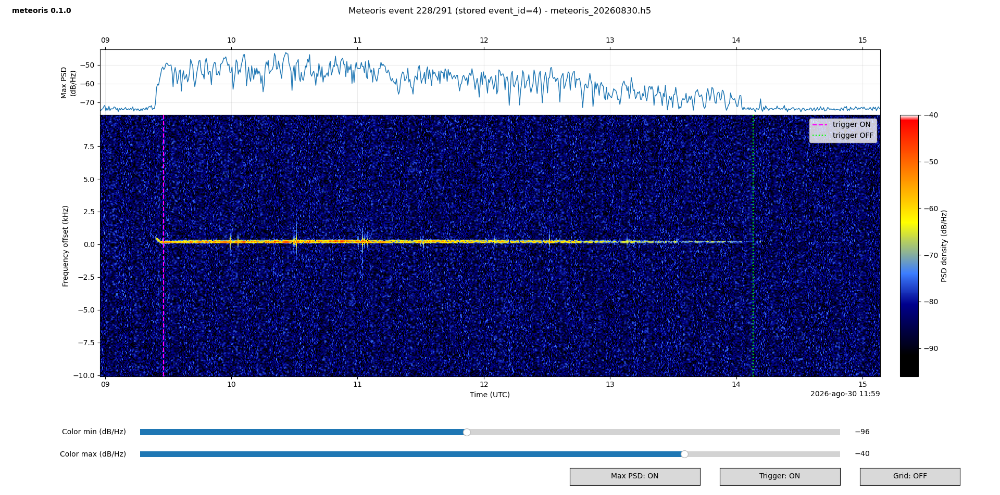
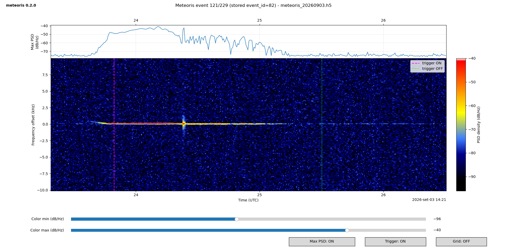

# Meteoris

Meteoris is a program suite for real-time capture, recording, and analysis of
radio signals produced by meteor scatter. It works with any SDR receiver
supported by [SoapySDR drivers](https://github.com/pothosware/SoapySDR/wiki).

It consists of a capture/recording program (`meteoris`) that continuously
listens for incoming signals and saves them to a file when a meteor signal is
detected. The signals are recorded as time sequences of frequency power
spectrum densities (PSDs). This data can be displayed interactively offline
by a plotting program (`meteoris_plot`) as horizontal waterfall diagrams.
Meteoris configuration files can be easily genereted by an interactive
configuration wizard (`meteoris_config`).
When `meteoris` is ungracefully terminated (kill, shutdown, crash,
power loss), the recording file can become unreadable. It can be restored
by a recovery tool (`meteoris_recover_hdf5`).
A SoapySDR simulator driver is also available.
It synthesizes typical meteor-scatter radio signals that can be
recorded by Meteoris and is useful for adjusting critical receiver and detector
parameters.

Meteoris supports Linux x86/x86_64, Linux ARM64, and Windows x86/x64 platforms.
Linux has been tested on Ubuntu/Linux on x86/x86_64, on Raspberry Pi OS Trixie
on Raspberry Pi 3B. Windows 11 has been tested on x86/x86_64. All with the
[HackRF One SDR](https://hackrf.readthedocs.io/en/latest/hackrf_one.html).

Meteoris should currently be considered alpha software. The authoritative
package version is stored in the root `VERSION` file and is reported by all
installed commands with `--version`.

### Author's Note

This project is completely AI-generated; the code has not been manually
reviewed line by line. Only this README was originally handwritten. The
author provided the ideas, requirements, and some of the solutions.
Without AI, this project probably would not exist.


# Main Features

  * Supports SDR receivers available through SoapySDR.
  * One source tree for Linux x86/x86_64, Linux ARM64, and Windows x86/x64.
  * Fully configurable through a file or command-line options.
  * Continuous **10 Msps** input.
  * Final selectable **100 kHz observation band**.
  * Pluggable meteor signal detectors, including peak/track and
    Echoes-style automatic threshold detection.
  * Efficient HDF5 storage format for meteor-event data.
  * Interactive configuration wizard `meteoris_config`.
  * Live `meteoris_web` browser waterfall and TCP control gateway.
  * Conservative `meteoris_recover_hdf5` helper for files left uncleanly closed.
  * Event-list display with details for each event.
  * Interactive event display with a time/frequency waterfall, an optional
    per-time-column maximum-PSD trace, shared time axes, and signal level
    represented by color.
  * SDR simulator that generates synthetic meteor-scatter radio signals
    for testing and calibration.

**For the impatient: see the [Meteoris Cheat Sheet](doc/CHEATSHEET.md) for the
short path from build and configuration to recording and viewing events.**


# [Download, Build and Install](doc/INSTALL.md)

Linux uses the single `build.sh` entry point on x86 and ARM64/Raspberry Pi.
Windows x86/x64 uses the matching `build.ps1` entry point. Both offer the same
two modes and include the HDF5 recovery command:

- **Full:** `meteoris` + `meteoris_plot` + `meteoris_config` +
  `meteoris_recover_hdf5` + `meteoris_web`
- **Recorder-only:** `meteoris` + `meteoris_config` + `meteoris_recover_hdf5` +
  `meteoris_web`

The recorder-only mode omits the plotting tool and simulator, but deliberately
keeps `meteoris_config`, `meteoris_recover_hdf5`, and `meteoris_web` so a
headless recorder can be configured/recovered locally and monitored from a
browser.
On Linux, run `./build.sh` and choose `1` or `2`, or use `--full` /
`--recorder-only`; `install.sh` reuses the last successful build. On Windows,
use `build.ps1 -Mode full` or `build.ps1 -Mode recorder-only`, followed by
`install.ps1`.

See [INSTALL.md](doc/INSTALL.md) for dependencies and target details.


# [Set Meteoris Configuration](doc/SET_CONFIG.md)

The installed `meteoris_config` helper can create a complete commented
`meteoris.toml` interactively:

```bash
meteoris_config
```

If `./meteoris.toml` exists, its current values are proposed as defaults. You
can also name another existing file, for example `meteoris_config site.toml`.
The wizard offers **smart** mode (essential settings only) and **expert** mode
(all settings). Each prompt is numbered as `section.parameter`, includes a short
explanation, and the same numbered explanation is written as a TOML comment.
Before writing, the wizard offers an input review; smart mode reviews only the
settings it asked. The default output name is `meteoris.toml.new`. See
[CONFIG_WIZARD.md](doc/CONFIG_WIZARD.md) for the complete workflow.

Meteoris uses the simple [TOML format](https://toml.io/en/) for its
configuration files. A TOML file is divided into sections identified by names
in square brackets (for example, `[this_is_a_section_id]`). Each section
contains parameters, normally one per line, written as a parameter name
followed by its value (for example, `parameter1 = 100`).

See [SET_CONFIG.md](doc/SET_CONFIG.md) for configuration details.

# Run the Recorder

To run the Meteoris recorder, choose a working directory, copy the example
configuration file (`config/meteoris.toml`) there, adjust it as described
above, and then launch the recorder. If Meteoris is installed system-wide,
simply run:

```bash
meteoris
```

Meteoris is intended for long-running operation. It can run for hours or
days while waiting for events. For unattended operation, Meteoris can be
run as a daemon detached from the terminal:

```bash
meteoris --daemon
```

If the **`[output]`** section is left unchanged, recorded data is written to
the **`data`** subdirectory. Files are rotated daily and named
**`meteoris_YYYYMMDD.h5`**, where `YYYY` is the year, `MM` the month, and `DD`
the day.

Recording can also be continuous, in which case detector triggers are ignored.
This mode is useful for testing and debugging. See
[Recording Modes](#recording-modes) below.

If Meteoris fails to open an existing output file after an ungraceful
termination such as a process crash, forced kill, or system shutdown, recover
a copy conservatively with:

```bash
meteoris_recover_hdf5 data/meteoris_YYYYMMDD.h5
# Interactive prompt: recover to another file (recommended) or in place.
# Non-interactive: --output FILE or --in-place.
```

The default/recommended choice recovers to a separate file and leaves the
original untouched. In-place recovery is also available after a warning and
explicit confirmation. The helper clears only a detected stale HDF5 writer
flag and uses `h5clear --increment` only when an EOA/EOF mismatch is confirmed.
See [Recover HDF5 Output Files](./doc/RECOVER_HDF5.md) for the
manual procedure, validation steps, and stop conditions.


# Display Recorded Data

The Meteoris display program is normally run from the same working directory as
the recorder. Copy the example plotting configuration
(`config/meteoris_plot.toml`) there and run:

```
meteoris_plot data/meteoris_YYYYMMDD.h5
```

where `YYYYMMDD` is the year, month, and day of the file to display.
The Meteoris viewer accepts the following keys for interactive navigation
through recorded events. Interactive browsing reuses a single Matplotlib GUI
window: moving to another event redraws that same window instead of closing and
reopening it, preserving the window position/maximized state and avoiding desktop
focus flicker.

- `Space`/`Enter`: next event
- `Shift+Space`/`Shift+Enter`: previous event
- digits then `Space`/`Enter`: jump to that event
- `Backspace/Delete`: edit jump number
- `Esc`: clear jump number
- `z`/`x`/`c`/`v`: skip by -20/-10/+10/+20 events
- `n`: choose the HDF5 filename used to save selected event data with a file
  chooser; no terminal input or Enter key is required
- `w`: write/append the HDF5 data of the currently displayed event to the selected
  save file; if `n` has not been used, the default is `meteoris_saved.h5`
- `r`: refresh a live SWMR file
- `q`: quit
- close the window: quit

Saved-event HDF5 files are created on the first `w` command and appended on
subsequent `w` commands. They retain the Meteoris PSD datasets, frequency axis,
and file metadata and can be opened again directly with `meteoris_plot`. Saved
events are assigned sequential event IDs in the destination file. A destination
with an incompatible frequency axis is rejected rather than mixed with the
current data.

The viewer also provides interactive PSD color-limit sliders and controls for
the display:

- **Band: HALF/FULL** switches the waterfall between the central 50% of the
  recorded PSD bandwidth and the complete recorded bandwidth. The Max/Median
  summary is recalculated over the same displayed frequency bins.
- **Max PSD** toggles a plot stacked above the waterfall. It shows both the
  maximum and median PSD density (dB/Hz) across all displayed frequency bins for
  each time column. The upper plot shares the waterfall time axis and repeats the time
  ticks at the top. When the Max PSD plot is hidden, the waterfall expands to
  use the released vertical space; enabling it restores the stacked layout.
- **Trigger** shows or hides detector trigger markers.
- **Grid** shows or hides the plot grid.

The initial button states/mode are configurable in `meteoris_plot.toml`. Half
band is the default:

```toml
[buttons]
bandwidth = "half"   # "half" or "full"
max_psd = true
trigger = true
grid = false
```

These values are defaults for each event when it is displayed; clicking a
button changes only the current plot.

The GUI window state is also controlled by `meteoris_plot.toml`:

```toml
[plot]
window_mode = "maximized"   # "maximized" or "normal"
figure_width = 11.5         # used in normal mode
figure_height = 7.2         # used in normal mode
```

`window_mode` is enforced after every event redraw, so a maximized viewer stays
maximized while navigating. In `normal` mode, every event uses the configured
figure width and height.

- The display header identifies the Meteoris version and shows the current
  event as `<event>/<total events in file>`, together with the recorded-data
  filename and the existing event information.

Meteoris uses HDF5 Single-Writer/Multiple-Reader (SWMR) mode by default so the
active daily recording can be inspected without stopping acquisition or making
a copy. While browsing an active SWMR file:

- `R` refreshes all growing datasets and the event list.

Example of a typical meteor-scatter event captured by Meteoris. It is an echo
of the GRAVES transmitter (143.050 MHz, Dijon, France) from the overdense
ionized trail of a meteor. Spectrogram zoomed.



Example of meteor scatter with a complex structure. Spectrogram zoomed.


Example of a strong meteor scatter. Spectrogram zoomed.




# [Simulator](doc/SIMULATOR.md)

The Meteoris simulator is a SoapySDR-compatible RX driver for detector and
recorder tests. It generates two independent finite signal classes in
each configurable period:

1. a near-zero stationary echo with linear rise, hold and gradual fade;
2. one spectrally clean descending linear chirp at a separate time.

Cycle count, per-cycle amplitude reduction, noise, timing, stationary offset,
and chirp endpoints are configurable in `[simulator]` inside
`config/meteoris_sim.toml`.

See [SIMULATOR.md](doc/SIMULATOR.md) for all details.

# References and Internals

[Configuration File Reference](./doc/CONFIG_FILE_REFERENCE.md)

[Detailed Features](./doc/DETAILED_FEATURES.md)

[Detection Algorithm](./doc/DETECTOR.md)
Note: the detector algorithm is still under development and may require
further tuning to reduce false triggers caused by noise.

[Echoes-style Automatic Detector](./doc/ECHOES_AUTOMATIC_DETECTOR.md)

[DSP Pipeline](./doc/DSP_PIPELINE.md)

[HDF5 Recording Format](./doc/RECORDING_FORMAT.md)

[Recover HDF5 Output Files](./doc/RECOVER_HDF5.md)

[BUG20260902: one-PSD spectrogram dropout after trigger ON](./doc/BUG20260902.md)

**Live browser/network architecture:** see [NETWORK_WEB.md](doc/NETWORK_WEB.md).

### Notes

Meteoris currently requires native `CS8` input from the selected SoapySDR
device/driver. The main HackRF acquisition path uses direct buffers when
available.

The Release build enables `-ffast-math` and `-fno-math-errno` for the DSP
executable. `-march=native` is enabled by default and should be disabled for
cross-machine binary distribution.

When available, the optional FFTW backend is recommended for FFT processing.
On the tested x86-64 system, FFTW makes the FFT kernel approximately 3x faster
than the embedded radix-2 implementation. With the current 4096-point PSD
pipeline, this corresponds to roughly a 35--40% reduction in post-FIR1
processing time and an 8--10% reduction in overall DSP processing time. The
end-to-end gain is smaller because FIR/NCO, decimation, windowing, PSD
calculation, detector processing, and I/O are unaffected by the FFT backend.

### Tentative-track diagnostics

When no track is active but tentative candidates exist, the `DET` diagnostic
line now includes one representative `tentative{...}` record with class,
frequency, velocity, excess, age, occupancy, hit count and missed time. This
is useful for tuning activation parameters against real stationary echoes and
chirps.

Close-peak consolidation is treated as normal detector behavior. A rate-limited
warning is emitted only when `max_peaks_per_psd` is actually exceeded and peaks
must be dropped.


### Finite stationary and chirp simulator events

The `meteoris_sim` source generates a finite near-zero rise/hold/fade echo and
a separate clean linear chirp instead of a permanent carrier. Both event
amplitudes and timing are independently configurable. CS8 conversion continues
to use stochastic rounding and generous headroom to prevent coherent 2x/3x
intermodulation chirps.


### Daily text-log rotation

Text logging is rotated by UTC logical day by default:

```toml
[logging]
file = "meteoris.log"
daily_rotation = true
daily_rotate_time = "00:00"
```

With rotation enabled, `meteoris.log` becomes files such as
`meteoris_20260829.log`. The `HH:MM` boundary follows the same UTC logical-day
convention as `output.daily_rotate_time`. Log rotation is independent of HDF5
events and occurs on the first log message after the configured boundary.


### SDR overflow handling

SoapySDR stream overflows (`SOAPY_SDR_OVERFLOW`) are treated as recoverable
acquisition errors. Meteoris logs an `error` message, increments the overflow
counter, discards the affected read, and immediately continues acquisition.
Other negative SoapySDR stream errors remain fatal.


### Detector plugin architecture

Detector algorithms are now separated from `meteoris.cpp` behind a versioned
synchronous `IDetector` interface. The detector is selected with:

```toml
[detector]
plugin = "peak_tracker"
threads = 1
```

Available detector plugins are `peak_tracker` and `echoes_automatic`. Their
implementations live in `src/detector/peak_tracker_detector.cpp` and
`src/detector/echoes_automatic_detector.cpp`. Structured metrics and detector
objects cross the interface for logging and future HDF5/plot/replay tools. See
[`doc/DETECTOR_PLUGIN_API.md`](doc/DETECTOR_PLUGIN_API.md).


### Recording modes

Meteoris has two application-level PSD recording modes:

```toml
[recording]
mode = "triggered"
segment_seconds = 15.0
segment_count = 0
```

`triggered` uses the configured detector and preserves the normal pre/post
context and event semantics.

`continuous` ignores detector state and writes every PSD. Continuous data is
divided into bounded sequences of `segment_seconds`. Each sequence receives a
new HDF5 `event_id`; `detector_state` remains neutral (`0`). `segment_count=0`
records indefinitely, while a positive count stops cleanly after that many
complete segments.

The convenience CLI:

```text
--record N
```

selects continuous mode and records `N` segments (`N=0` means unlimited).
`--record-segment-seconds S` overrides segment length.

Daily HDF5 rotation occurs only between continuous segments, so a segment that
crosses the configured daily boundary remains whole in the previous file.


### Logging

Meteoris runtime output is handled by `spdlog`. The default log format is:

```text
<unix-seconds.ms> [level] message
```

Example:

```text
1787983200.137 [info] detector=ON peak_tracker ...
1787983201.044 [debug] DET ready=YES event=IDLE bg=-70.53dB/Hz peaks=0 ...
```

Configure logging with:

```toml
[logging]
level = "info"
color = true
```

Foreground levels are colored when supported: info is green, warnings are
yellow, errors are red, debug/trace messages are white, and critical messages
are bold red. Detector periodic diagnostics
are emitted at `debug`, so use `level = "debug"` while tuning the detector.
File logging is enabled by default in both foreground and daemon mode.
Foreground mode also logs to the terminal; daemon mode logs to the text file
only. Syslog is not used. The file log never contains ANSI colors. `info` and
higher-severity records are flushed to the file immediately, so daemon startup
and state-change messages are visible without waiting for a warning, shutdown,
or an output-buffer fill. Periodic detector diagnostics remain `debug` messages;
use `level = "debug"` when those recurring details are wanted. In triggered
recording, each retained event also emits an `event_recorded` DEBUG line. If a
`peak_tracker` event reaches `max_event_seconds`, it emits `event_discarded`
instead; the final INFO summary reports both `recorded_events` and
`discarded_events`.

CLI overrides include `--log-level`, `--log-color`, and `--no-log-color`.

---

Copyright (c) 2026 Fabrizio Pollastri. Licensed under the GNU General Public License v3.0; see `LICENSE`.
